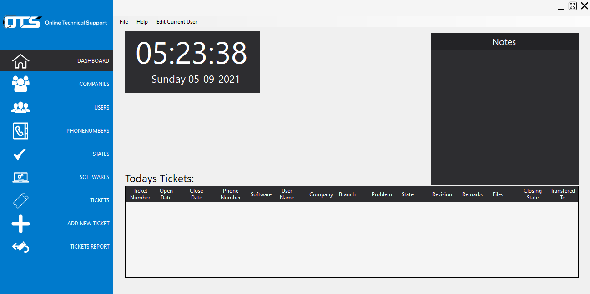

# TicketVerse

## about The Project

### The Problem: 
In order to archive and make a database consists of: 
Who, When and Why the customer called…? 
Then what's the problem, who answered, what happened and if the problem is solved or not. 
This is a basic software that record and display the incoming calls for a question or a problem in such a part of their works (for example; a company called Future of Technology … have a call center called OTS online technical support that receive calls for problems and questions that occurred with the customers on such programs) …

### Solution:
The main idea of the program is to store and record the fixed tickets or the unfixed ones or to check how many calls the call center is receiving and what should take in mind to upgrade the work and develop the call center. 
Current reports are: 
- How many calls received a day. 
- How many fixed tickets in a period of time. 
- How many calls received by a company or a user or a problem. 
- Who answered the most and fixed the problems.

## Built With

* [.NET Framework 4.5.2](https://dotnet.microsoft.com/en-us/learn/dotnet/what-is-dotnet-framework)
* [Dapper](https://github.com/DapperLib/Dapper)
* [SQL Server](https://www.microsoft.com/en-us/sql-server/sql-server-downloads)

### Screens

<h4>Main Menu</h4>

<h4>Insert Ticket Screen</h4>

